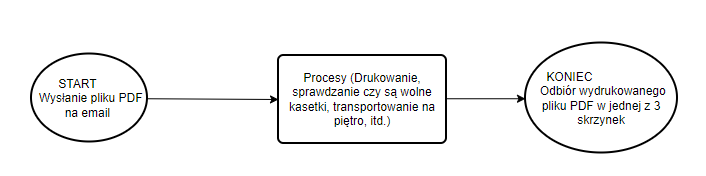
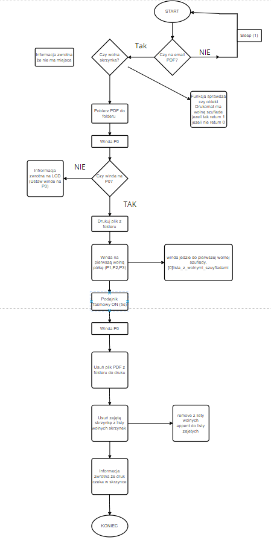

# print-box

## Cel projektu:

Celem projektu jest stworzenie systemu który będzie dostarczał wydrukowane strony w PDF na pierwszej wolnej skrzynki w szafie na ostatnim piętrze biurowca.

## Opis projektu.

W biurowcu w firmie na ostatnim pietrze nie ma drukarki, drukarka znajduje się na parteże. W firmie na ostatni pietrze znajduje się szafa przypominająca paczkomat. 
Drukarka znajdująca się na parteże (P0) drukuje PDF wysłany na email "drukarka@biuro.com" i zawozi wydrukowany PDF do PIERWSZEJ WOLNEJ SKRZYNKI (Są 3 wolne skrzynki). 

### Założenia programu

Wysłas na email 4 pliki PDF, program pobierze wszystkie 4 pliki, umieści je w odpowiednim foldeze a nastepnie bedzie drukował każdy plik pd i umieszczał w odpowiedniej szufladnie, 4 plik nie zostanie wydrukowany (ponieważ są tylko 3 szuflady) i powuinnismy dostać informacje zwrotną że "wszystkie szuflady zajete" 

Program pobiera i umieszcza w folderze WSZYSTKIE wysłane PDF na email  (jeżeli na emial jest 10 pdf program pobierze 10 pdf)
Program nie posiada kolejki, tzn nie można wysyłać pdf do druku jeden za drugim, nalezy wysłać jeden i poczekać aż program wydrukuje zawiezie na półke i wróci do stanu początkowego.
Program przyjmuje pliki od każdego uzytkownika (nie rozróżnia kto może a kto nie może drukować)

### Skrót schematu blokowego

### Schemat blokowy programu 

## Rysunek poglądowy 

## Sources

https://www.kagopro.pl/algorytmy-i-schematy/
https://stackoverflow.com/questions/61366836/download-attachment-from-mail-using-python