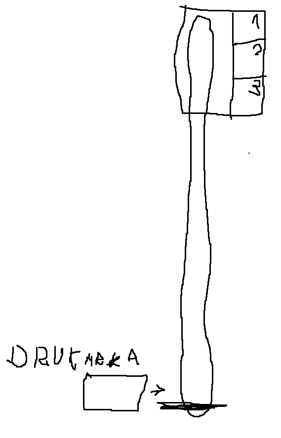

# print-box

## Cel projektu:

Celem projektu jest stworzenie systemu który będzie dostarczał wydrukowane strony w PDF na pierwszej wolnej skrzynki w szafie na ostatnim piętrze biurowca.

## Opis projektu.

W biurowcu w firmie na ostatnim pietrze nie ma drukarki, drukarka znajduje się na parteże. W firmie na ostatni pietrze znajduje się szafa przypominająca paczkomat. 
Drukarka znajdująca się na parteże (P0) drukuje PDF wysłany na email "drukarka@biuro.com" i zawozi wydrukowany PDF do PIERWSZEJ WOLNEJ SKRZYNKI (Są 3 wolne skrzynki). 

## Schemat blokowy 

## Rysunek poglądowy 

